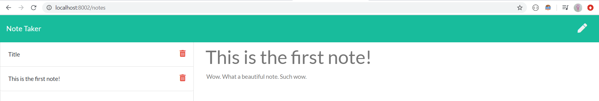
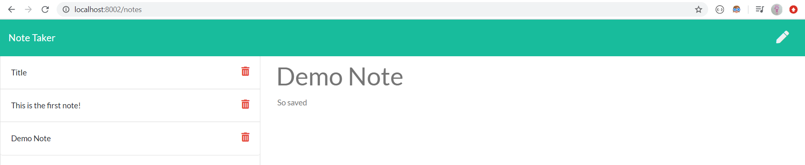
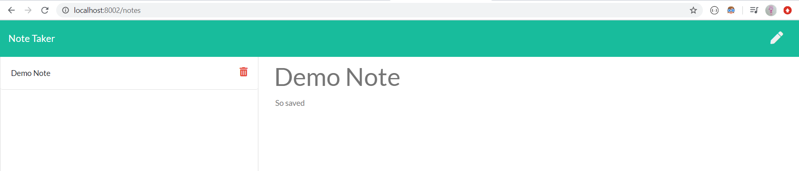

# note_taker
(https://github.com/emilyporterfieldtaylor/note_taker)

## Description  
This project most focused on Jest OOP testing and using pre written code to make a team generator app. This ap generates team members based on command line prompts. 
 

## Instructions
1. When you're ready, run node server.js to start the note_taker server.
2. Click on the start button when you are ready to begin taking notes.

3. Several note exampes are populated for you. Click on them to see what they say.

4. Click on the pencil icon to start a new note and the save icon to save it to the side bar.

5. Delete the notes you regret by clicking on the trash can icon.

6. Now nobody has to know about those terrible note taking skills of yours.

    
## Table of Contents

  *[Installation](#installation)
  *[Usage](#usage)
  *[License](#license)
  *[Contribution](#contribution)
  *[Tests](#tests)
  *[Questions](#questions)
    
## Installation
To install necessary dependencies, run the following command:

--
npm i
--
    
## Usage
A lot of this repo came from the UT bootcamp github.
    
## License
Creative Commons
 

    
## Contributing
Please provide feed back on app improvements. 
    
## Questions

​
If you have any questions about the repo, open an issue or contact https://github.com/emilyporterfieldtaylor